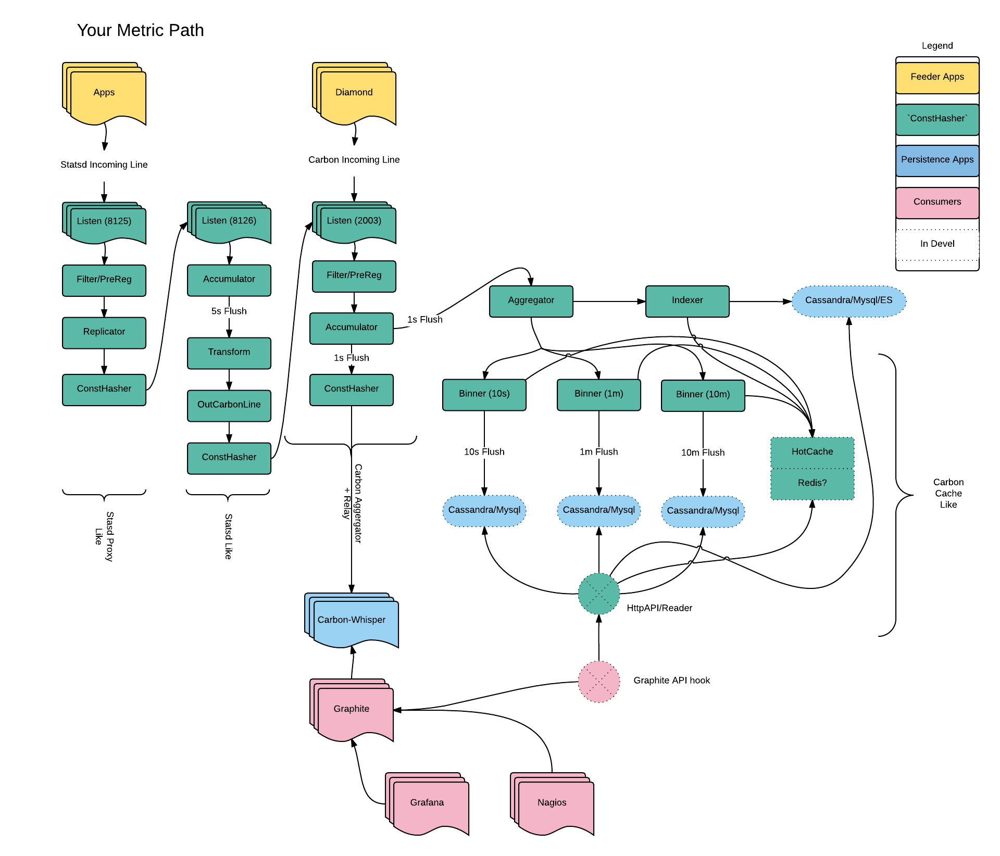

conshashsrv
===========

Generic Consistent hash Server (and well, much more) in Go

Note:: configuration for complex scenarios of loop backs, replicas moving, multiple backends, accumulators, and aggregators 
can get confusing .. and you can find yourself hitting yourself over the head alot.  You's say "why not keep it simple"
If metrics collection and manipulating was simple, I would not have to write this.

Installation
------------

    Well, first you need to install go .. https://golang.org  1.5.1
    

    git clone git@scm-main-01.dc.myfitnesspal.com:infra/consthashsrv.git
    export GOPATH=$(pwd)/src
    
    cd src/
    
    # because things are "private" we need to "hack around" go's usual pulling/get mechanism
    #pull in more git repos you'll need
    git clone git@scm-main-01.dc.myfitnesspal.com:goutil/statsd.git
    git clone git@scm-main-01.dc.myfitnesspal.com:goutil/consistent.git
    
    
    #get the deps
    go get github.com/BurntSushi/toml
    go get github.com/davecheney/profile
    go get github.com/reusee/mmh3
    go get gopkg.in/op/go-logging.v1
    go get github.com/smartystreets/goconvey/convey
    go get github.com/go-sql-driver/mysql
    go get github.com/gocql/gocql

    
    cd ../
    make
   

Examples
--------

Look to the "example-config.toml" for all the options you can set and their meaning
and config directory for more examples.

to start

    consthash --config=example-config.toml
    
There is also the "PreReg" options files as well, this lets one pre-route lines to various backends, that can then 
be consitently hashed, or "rejected" if so desired, as well as "accumulated" (ala statsd or carbon-aggrigate)

    consthash --config=example-config.toml --prereg=example-prereg.toml

What I do
---------

This was designed to be an arbitrary proxy for any "line" that has a representative Key that needs to be forwarded to
another server consistently (think carbon-relay.py in graphite and proxy.js in statsd) but it's able to handle
any other "line" that can be regex out a Key.  

It Supports health checking to remove nodes from the hash ring should the go out, and uses a pooling for
outgoing connections.  It also supports various hashing algorithms to attempt to imitate other
proxies to be transparent to them.

Replication is supported as well to other places, there is "alot" of polling and line buffereing so we don't 
waste sockets and time sending one line at a time for things that can support multiline inputs (i.e. statsd/graphite)

A "PreRegex" filter on all incoming lines to either shift them to other backends (defined in the config) or
simply reject the incoming line

Finally an Accumulator, which initially "accumulates" lines that can be (thing statsd or carbon-aggrigate) then 
emits them to a designated backend, which then can be "PreRegex" to other backends if nessesary
Currently only "graphite" and "statsd" accumulators are available such that one can do statsd -> graphite or even 
graphite -> graphite or graphite -> statsd (weird) or statsd -> statsd.  The {same}->{same} are more geared
towards pre-buffering very "loud" inputs so as no to overwhelm the various backends.

The Flow of a given line looks like so

    InLine(s) -> Listener -> Splitter -> [Accumulator] -> [PreReg] -> Backend -> Hasher -> OutPool -> Buffer -> outLine(s)
                                                                |
                                                                [-> Replicator -> Hasher -> OutPool -> Buffer -> outLine(s)]
Things in `[]` are optional

NOTE :: if in a cluster of hashers and accumulators .. NTP is your friend .. make sure your clocks are in-sync

## Accumulators 

Accumulators almost always need to have the same "key" incoming.  Since you don't want the same stat key accumulated
in different places, which would lead to bad sums, means, etc.  Thus to use accumulators effectively in a multi server
endpoint scenario, you'd want to consistently hash from the incoming line stream to ANOTHER set of listeners that are the 
backend accumulators (in the same fashion that Statsd Proxy -> Statsd and Carbon Relay -> Carbon Aggregator).  

It's easy to do this in one "instance" of this item where one creates a "loop back" to itself, but on a different
listener port.

     InLine(port 8125) -> Splitter -> [PreReg] -> Backend -> Hasher -> OutPool (port 8126)
        
        --> InLine(port 8126) -> Splitter -> [Accumulator] -> [PreReg] -> Backend -> OutPool (port Other)

This way any farm of hashing servers will properly send the same stat to the same place for proper accumulation.

Times here are always assumed to be "NOW" on the incoming items.  Items are given the "NOW" time when flushed. There 
is no "going backwards" in time. If that's something you require, alternate methods for getting your data to writers
should be used.  This only matters for accumulators. If no Accumulators are used in the pipline, time is maintained
in the original incoming line (if it has one, graphite does, statsd style does not).

Unlike the generic `graphite` data format, which can have different time retentions and bin sizes for different metrics
I have taken the approach that all metrics will have the same bin size(s).  Meaning that all metrics will get 
binned into `times` buckets that are the same (you can have as many as you wish) and to keep the math simple and fast
the timer buckets should be multiples of each other, for instance.

    times = ["5s", "1m", "10m"] 
    
OR w/ TTLs

    times = ["5s:168h", "1m:720h", "10m:17520h"] 
    
This also means the "writers" below will need to follow suit with their data stores and TTLs,  Things like MySQL and files
have no inherent TTLs so the TTLs are not relevant and are ignored, Cassandra, on the other hand, can have these TTLs per item. Also
TTLs are outed as "time from now when i should be removed", not a flat number.  

THe "base" accumulator item will constantly Flush stats based on the first time given (above every `5s`). It is then Aggregators
caches to maintain the other bins (from the base flush time) and flush to writers at the appropriate times. 

_MULTIPLE TIMES ONLY MATTER IF THERE ARE WRITERS._

### Writers

Accumulators can "write" to something other then a tcp/udp/http/socket, to say things like a FILE, MySQL DB or cassandra.
(since this is Golang all writer types need to have their own driver embed in).  If you only want accumulators to write out to 
these things, you can specify the `backend` to `BLACKHOLE` which will NOT try to reinsert the line back into the pipeline
and the line "ends" with the Accumulator stage.

    InLine(port 8126) -> Splitter -> [Accumulator] -> WriterBackend
    
Writers should hold more then just the "aggregated data point" but a few useful things like 

    Min, Max, Sum, Mean, and Count
    
because who's to say what you really want from aggregated values.
`Count` is just actually how many data points arrived in the aggregation window
   
Some example Configs for the current "3" writer backends

#### MYSQL

Slap stuff in a MySQL DB .. not recommended for huge throughput, but maybe useful for some stuff ..
You should make Schemas like so (`datetime(6)` is microsecond resolution, if you only have second resolution on the 
`times` probably best to keep that as "normal" `datetime`).  The TTLs are not relevant here.  The `path_table` is 
useful for key space lookups
    
    CREATE TABLE `{path_table}` (
        `path` varchar(255) NOT NULL DEFAULT '',
        `length` int NOT NULL
        PRIMARY KEY `stat` (`stat`),
         KEY `length` (`length`)
    ) ENGINE=InnoDB DEFAULT CHARSET=utf8;

    CREATE TABLE `{table}_{keeperprefix}` (
      `id` int(11) unsigned NOT NULL AUTO_INCREMENT,
      `stat` varchar(255) NOT NULL DEFAULT '',
      `sum` float NOT NULL,
      `mean` float NOT NULL,
      `min` float NOT NULL,
      `max` float NOT NULL,
      `count` float NOT NULL,
      `resolution` int(11) NOT NULL,
      `time` datetime(6) NOT NULL,
      PRIMARY KEY (`id`),
      KEY `stat` (`stat`),
      KEY `time` (`time`)
    ) ENGINE=InnoDB DEFAULT CHARSET=utf8;

If your for times are `times = ["10s", "1m", "10m"]` you should make 3 tables named

    {tablebase}_10s
    {tablebase}_60s
    {tablebase}_600s
    
And only ONE path table

    {path_table}

Config Options

    # Mysql
    #  NOTE: this expects {table}_{keepertimesinseconds} tables existing
    #  if timers = ["5s", "10s", "1m"]
    #  tables "{table}_5s", "{table}_10s" and "{table}_60s"
    #  must exist
    [mypregename.accumulator.writer]
    driver = "mysql"
    dsn = "root:password@tcp(localhost:3306)/test"
        [mypregename.accumulator.writer.options]
        table = "metrics"
        path_table = "metrics_path"
        batch_count = 1000  # batch up this amount for inserts (faster then single line by line) (default 1000)
        periodic_flush= "1s" # regardless if batch_count met, always flush things at this interval (default 1s)

#### File

Good for just testing stuff or, well, other random inputs not yet supported
This will dump a TAB delimited file per `times` item of

    statname sum mean min max count resolution nano_timestamp nano_ttl
    
If your for times are `times = ["10s", "1m", "10m"]` you will get 3 files of the names. 

    {filebase}_10s
    {filebase}_60s
    {filebase}_600s
    
    
Config Options

    # File
    #  if [keepers] timers = ["5s", "10s", "1m"]
    #  files "{filename}_5s", "{filename}_10s" and "{filename}_60s"
    #  will be created
    # 
    # this will also AutoRotate files after a certain size is reached
    [mypregename.accumulator.writer]
    driver = "file"
    dsn = "/path/to/my/filename"
        [mypregename.accumulator.writer.options]
        max_file_size = "104857600"  # max size in bytes of the before rotated (default 100Mb = 104857600)

#### Cassandra

This is probably the best one for massive stat volume. It expects the schema like the MySQL version, 
and you should certainly use 2.1 or 2.2 versions of cassandra.  Unlike the others, due to Cassandra's type goodness
there is no need to make "tables per timer".  Expiration of data is up to you to define in your global TTLs for the schemas.
This is modeled after the `Cyanite` (http://cyanite.io/) schema as the rest of the graphite API can probably be 
used using the helper tools that ecosystem provides.  (https://github.com/pyr/cyanite/blob/master/doc/schema.cql).  
There is one large difference between this and Cyanite, the metrics point contains the "count" which is different
then Cyanite as they group their metrics by "path + resolution + precision", i think this is due to the fact they
dont' assume a consistent hashing frontend (and so multiple servers can insert the same metric for the same time frame
but the one with the "most" counts wins in aggregation) .. but then my Clojure skills = 0. 
For consistent hashing of keys, this should not happen.

Please note for now the system assumes there is a `.` naming for metrics names

    my.metric.is.fun
    

You should wield some Cassandra knowledge to change the on the `metric.metric` table based on your needs
The below causes most compaction activity to occur at 10m (min_threshold * base_time_seconds) 
and 2h (`max_sstable_age_days` * `SecondsPerDay`) windows.
If you want to allow 24h windows, simply raise `max_sstable_age_days` to ‘1.0’. 

    compaction = {
        'class': 'DateTieredCompactionStrategy',  
        'min_threshold': '12', 
        'max_threshold': '32', 
        'max_sstable_age_days': '0.083', 
        'base_time_seconds': '50' 
    }

General Schema

    CREATE KEYSPACE metric WITH replication = {'class': 'SimpleStrategy', 'replication_factor': '3'}  AND durable_writes = true;

    USE metric;

    CREATE TYPE metric_point (
        max double,
        mean double,
        min double,
        sum double,
        count int
    );

    CREATE TYPE metric_id (
        path text,
        resolution int
    );

    CREATE TABLE metric.metric (
        id frozen<metric_id>,
        time bigint,
        point frozen<metric_point>,
        PRIMARY KEY (id, time)
    ) WITH COMPACT STORAGE
        AND CLUSTERING ORDER BY (time ASC)
        AND compaction = {
            'class': 'DateTieredCompactionStrategy',  
            'min_threshold': '12', 
            'max_threshold': '32', 
            'max_sstable_age_days': '0.083', 
            'base_time_seconds': '50' 
        }
        AND compression = {'sstable_compression': 'org.apache.cassandra.io.compress.LZ4Compressor'}
        AND dclocal_read_repair_chance = 0.1
        AND default_time_to_live = 0
        AND gc_grace_seconds = 864000
        AND max_index_interval = 2048
        AND memtable_flush_period_in_ms = 0
        AND min_index_interval = 128
        AND read_repair_chance = 0.0
        AND speculative_retry = '99.0PERCENTILE';
                                                                        
    CREATE TYPE metric.segment_pos (
        pos int,
        segment text
    );

    CREATE TABLE metric.path (
        segment frozen<segment_pos>,
        path text,
        length int,
        has_data bool,
        PRIMARY KEY (segment, path, has_data)
    ) WITH CLUSTERING ORDER BY (path ASC)
        AND bloom_filter_fp_chance = 0.01
        AND caching = '{"keys":"ALL", "rows_per_partition":"NONE"}'
        AND comment = ''
        AND compaction = {'class': 'org.apache.cassandra.db.compaction.SizeTieredCompactionStrategy'}
        AND compression = {'sstable_compression': 'org.apache.cassandra.io.compress.LZ4Compressor'}
        AND dclocal_read_repair_chance = 0.1
        AND default_time_to_live = 0
        AND gc_grace_seconds = 864000
        AND max_index_interval = 2048
        AND memtable_flush_period_in_ms = 0
        AND min_index_interval = 128
        AND read_repair_chance = 0.0
        AND speculative_retry = '99.0PERCENTILE';

    CREATE TABLE metric.segment (
        pos int,
        segment text,
        PRIMARY KEY (pos, segment)
    ) WITH COMPACT STORAGE
        AND CLUSTERING ORDER BY (segment ASC)
        AND bloom_filter_fp_chance = 0.01
        AND caching = '{"keys":"ALL", "rows_per_partition":"NONE"}'
        AND comment = ''
        AND compaction = {'class': 'org.apache.cassandra.db.compaction.SizeTieredCompactionStrategy'}
        AND compression = {'sstable_compression': 'org.apache.cassandra.io.compress.LZ4Compressor'}
        AND dclocal_read_repair_chance = 0.1
        AND default_time_to_live = 0
        AND gc_grace_seconds = 864000
        AND max_index_interval = 2048
        AND memtable_flush_period_in_ms = 0
        AND min_index_interval = 128
        AND read_repair_chance = 0.0
        AND speculative_retry = '99.0PERCENTILE';

### Listen Server Types

All inputs and out puts can be tcp, udp, unix socket, or http

    tcp -> tcp://127.0.0.1:2003
    udp -> udp://127.0.0.1:8125
    unix -> unix:///my/socket.sock
    http -> http://moo.org/stats
    

http expects the BODY of the request to basically be the lines

    GET /stats HTTP/1.1
    Host: moo.org
    Accept: */*
    
    key value thing
    key value thing2

There is also a special `listen` called `backend_only` which is simply a place where things can routed to internally
(from say a `PreReg` filter or `Accumulator`) that then out puts to it's consthash server outgoing list
    
### Input line types for no accumulator
 
    Graphite: <key> <value> <time>
    Statsd: <key>:<value>|<type>|<samplerate>
    Regex: (<\d+>)?(?P<Timestamp>[A-Z][a-z]+\s+\d+\s\d+:\d+:\d+) (?P<Key>\S+) (?P<Logger>\S+):(.*)

 - note: regex need a `(?P<Key>...)` group to function as that will be the hashing key, other fields are ignored

### Input line types for using accumulator

    Graphite: <key> <value> <time>
    Statsd: <key>:<value>|<type>|<samplerate>

### Internal Stats

It runs it's own micro stats server so you can ping it for it's internal stats (very lightweight at the moment)
We can make a fancy status page when necessary

    # for a little interface to the stats
    
    localhost:6061/

    # the json blob stats for the above html file
    
    localhost:6061/stats
    
    # if you want just a specific server set
    
    localhost:6061/echo-example/stats

It will also emit it's owns stats to statsd as well using a buffered internal statsd client (https://gitlab.mfpaws.com/goutil/statsd).

#### Handy "what are the URL" reference (because i always forget myself)

    http://localhost:6060/servers

### Status

If you have some checker (say nagios) and you want to get the helath status of the server itself

    localhost:6061/ops/status
    
IF you want a specific exerver set

    localhost:6061/echo-example/ops/status

### Check Keys/Server pairs

You can "check" what server a given "key/line" will go to as well using a little json GET url

    localhost:6061/hashcheck?key=XXXXXX
    
This will dump out the server this key will go to and the actuall "hash" value for it for all various running hash servers

### Add/Remove hosts dynamically

You can also Add and remove servers from the hashpool via a POST/PUT

    curl localhost:6061/echo-example/addserver --data "server=tcp://127.0.0.1:6004"
    
     PARAMS:
     
     - server: url : url of the host to add (udp/tcp)
     - check_server: url: url of the server to "check" for the above server that it is alive (defaults to `server`)
     - hashkey: string: the "string" that is the KEY for the hash algo (see `hashkeys` in the TOML config)
     - replica: int: the index of the replica (if any) for a server definition (defaults to 0)
    
    curl localhost:6061/echo-example/purgeserver --data "server=tcp://127.0.0.1:6004"
    
    PARAMS:
    
    - server: url : url of the host to add (udp/tcp)
    - replica: int: the index of the replica (if any) for a server definition (defaults to 0)
            
   
here `echo-example` is the name of the toml server entry 

    
Testing and Dev
---------------

Some quick refs for performance and other "leaky/ram" usages for tuning your brains
(we've the profiler stuff hooked)

    
    go tool pprof  --inuse_space --nodefraction=0.0001 --web  http://localhost:6060/debug/pprof/heap
    go tool pprof  --inuse_objects --nodefraction=0.0001 --web  http://localhost:6060/debug/pprof/heap
    go tool pprof  --alloc_space --nodefraction=0.0001 --web  http://localhost:6060/debug/pprof/heap
    go tool pprof  --alloc_objects --nodefraction=0.0001 --web  http://localhost:6060/debug/pprof/heap
    go tool pprof --nodefraction=0.0001 --web  http://localhost:6060/debug/pprof/profile
    
    
    # just how many mutex locks are stuck?
    curl http://127.0.0.1:6061/debug/pprof/goroutine?debug=2
    

things come with an "echo server" which is simply what it is .. just echos what it gets to stdout

the make will make that as well, to run and listen on 3 UDP ports

    echoserver --servers=udp://127.0.0.1:6002,udp://127.0.0.1:6003,udp://127.0.0.1:6004
    
    # 3 tcp servers
    echoserver --servers=tcp://127.0.0.1:6002,tcp://127.0.0.1:6003,tcp://127.0.0.1:6004
    

You may want to get a statsd deamon (in golang as well) .. (github.com/bitly/statsdaemon)

    statsdaemon -debug -percent-threshold=90 -percent-threshold=99  -persist-count-keys=0 -address=":8136" -admin-address=":8137"  -receive-counter="go-statsd.counts" -graphite="127.0.0.1:2003"

There is also a "line msg" generator "statblast"

   
    Usage of statblast:
      -buffer int
            send buffer (default 512)
      -forks int
            number of concurrent senders (default 2)
      -rate string
            fire rate for stat lines (default "0.1s")
      -servers string
            list of servers to open (tcp://127.0.0.1:6002,tcp://127.0.0.1:6003) (default "tcp://127.0.0.1:8125")
      -type string
            statsd or graphite (default "statsd")

Author
------

boblanton@myfitnesspal.com 2015 MyFitnesspal