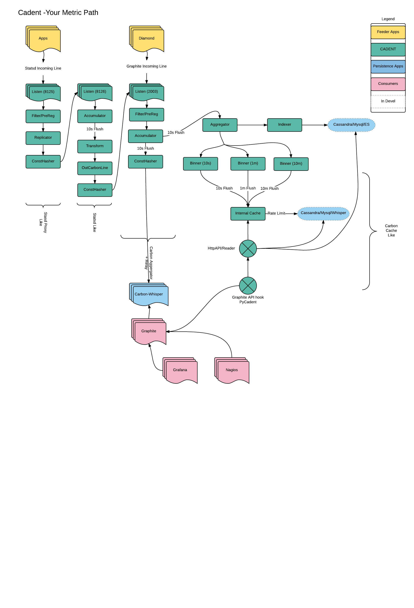

Cadent
======

Manipulate your metrics

Philosophy: If it's not measured it does not exist.

Cadent itself spews about 400-500 of it's own metrics for instances (which of course it just emits to itself if configured to).
As far as i can tell only Kafka followed by Cassandra spew forth more (and Kafka is obscenely verbose, to the point of just not useful really).

### The beginnings.

Graphite (carbon) + Statsd:  The champions of getting metrics stored and queried quickly.  I hesitate to say almost every startup started here
(Except those acctually old enough to have started w/ SNMP and RRDtool, I include myself here) with these two wonderful tools.  However, it turns out
we collect more metrics per second from all the various sources then any sort of actual user trafic (by a few orders
of magnitude).  It, not being customer facing, (not customer facing in the eyes of the business, but certainly "internal" customer
facing) the resources allocated to keeping it running and useful are sparse.

But as much as I love, use, hack, tinker and futz with graphite + statsd.  There are three big issues, it's reliance on disks,
single threaded and general performance while trying to keep a few TBs of metrics online and queried, make it difficult to scale (not impossible
by any means), just not easy.

I think is now a common issue in the ecosphere of metrics/ops folks now.  And as a result _many_ projects exist out there in the echo system
that handle lots of "parts" of the problem.  Cadent attempts to merge many of them (it's
"standing on the sholders of giants", uses other good opensource pieces in the wild, and is certainly not the most performant things in the world) in one binary.
Every situation is different, data retention requirement, speed, input volume, query volume, timeording,
persistence solutions etc.  Each one comes with it's own cost to run (something alot of projects fail to mention).  For instance if you're just starting,
you're probably not going to have a good sized cassandra cluster and a good sized kafka cluster, as your app
probably runs on one (maybe two) instances.  But you probably have a Database somewhere, or at least a hardrive.
As you expand, you start to hit the "wall". There's no way around it.  But let's make moving that wall easier.

### The Name:

is "k-dent" as in "`k` as in `cake`" `\ˈkā-dənt\` ..
call it "ca-dent" (`ca` as in `cat`) if you really want to .. but that holds no real meaning (just look it up)

### Function

Basically this acts like many tens of existing projects out in the wilderness that either are, or act like, the standard "set": statsd, statsd-proxy, carbon-relay, carbon-aggegator, carbon-cache.

It "sorta" behaves like carbon-cache, (as it can read/write to whisper files but does not have the "entire functionality set" of carbon-cache)
Cassandra, and even a SQL DB if you really think that's a good idea, watch as you kill your RDBS trying to insert 100k items in 1 second)

But dramatically retooled and optimized to handle 100's of thousands of metrics a second.

Has a pipeline feel but optimized for what we really need

 - consistent hashing relay
 - metric filter and router
 - relay replication
 - accumulation and aggregation
 - time series writing
 - metric indexing
 - api endpoints

Yes "each" of the above can be handled by a standalone app (and many do exist in the echo system) .. however at the volume
we want to address .. there's nothing like raw RAM/CPU power on a local node (the internet, slow, ram, fast).

Note:: configuration for complex scenarios of loop backs, replicas moving, multiple backends, accumulators, and aggregators
can get confusing .. and you can find yourself hitting yourself over the head alot.  You's say "why not keep it simple"
If metrics collection and manipulating was simple, I would not have to write this.

### What it does not do.

Visualization: In the visualization world grafana wins, period, we're not visualizing things in cadent.

`result = f(timeseries)`: Graphite/graphite-api also win here, by alot.
Their DSL for applying `fancy math` to timeseries is near impossible to match (not impossible, but really hard to
recreate it as it's depth is rather mystifying sometimes).

## Why is it designed this way?

Well, no system lives in a vacuum.  You probably already have a graphite cluster, maybe OpenTSDB, or what have you, and
need to migrate systems as whatever you are using is falling down (for reasons, as ops folks, i hope you know). But you cannot
just "cut the cord" to the old system as there are many dependencies on it already.  Time series never stop, never slow
down, never go away. So each peice of this puzzle is made to partially replace another.  If one element cannot be "out of the box"
replaced, then replication to a new system is there to feed things to the old one, while bootstrapping the new one.

That's why this looks a bit like plaster covering a few holes left by a few baseballs.  You can only cover one hole
at a time.

Installation
------------

Well, first you need to install go .. https://golang.org  >= 1.5.1
And a kernel that supports SO_REUSEPORT (linux 3.9 or higher and bsd like kernels)
And make sure to use VENDOR support (in golang 1.6, this is the default),
go 1.7.x is perfered as it's better, faster, stronger.

    git clone {path to repo}
    export GOPATH=$(pwd)

    make

Examples Configs
----------------

Look to the [config directory](./config/README.md) for all the options you can set and their meaning

to start

    cadent --config=configs/graphite/graphite-config.toml

There is also the "PreReg" config files as well.

This does many things optionally

    1. Lets one pre-route lines to various backends (as defined in the --config file)
    2. Reject incoming lines based on the key name
    3. Accumulates stats into time buckets (i.e. like statsd, but for any metric)
    4. Fowards those accumulated lines back into other backends and/or
    5. Writes index to indexer backends
    6. Writes metrics to metric backends
    7. Defines API endpoints

    cadent  --config=configs/graphite/graphite-config.toml --prereg=configs/graphite/graphite-cassandra-series.toml

To get started there is a docker-compose.yml prepared to fire up any writer backend you wish.

What Cadent does
----------------

Once upon a time, our statsd servers had __waaaayyyy__ to many UDP errors (a common problem I've been told).
Like many projects, necessity, breeds, (well, more necessity, but that's another conversation)...
So a Statsd Consistent Hashing Proxy in Golang was written to be alot faster and not drop any packets.

And then ...

This was designed to be an arbitrary proxy for any "line" that has a representative Key that needs to be forwarded to
another server consistently (think carbon-relay.py in graphite and proxy.js in statsd) but it's able to handle
any other "line" that can be regex out a Key, like fowarding loglines to an ELK cluster farm.

And then ...

It Supports health checking to remove nodes from the hash ring should the go out, and uses a pooling for
outgoing connections (mostly because the cloud is a nice place).

It also supports various hashing algorithms to attempt to imitate other
proxies to be transparent to them.

And then ...

Replication is supported as well to other places, there is "alot" of pooling and line buffereing so we don't
waste sockets and time sending one line at a time for things that can support multiline inputs (i.e. statsd/graphite)

And then ...

A "Regex" filter on all incoming lines to either shift them to other backends (defined in the config) or
simply reject the incoming line (you can thank kafka for this addition ;)

And then ...

well running 20 statsd processes to just handle the load seemed silly, thus ....

Accumulators. which initially "accumulates" lines that can be (thing statsd or carbon-aggrigate) then
emits them to a designated backend, which then can be "PreRegex" to other backends if nessesary
Currently only "graphite" and "statsd" accumulators are available such that one can do statsd -> graphite or even
graphite -> graphite or graphite -> statsd (weird) or statsd -> statsd.  The {same}->{same} are more geared
towards pre-buffering very "loud" inputs so as no to overwhelm the various backends.

NOTE :: if in a cluster of hashers and accumulators .. NTP is your friend .. make sure your clocks are in-sync

And then ...

Data stores, since we have all the data, why not try a more another data store, one that is not so Disk sensitive?
Whisper, Cassandra, Kafka, Mysql, TextFile, {add your own driver}

And then ..

Indexers.  Needs to be able to index the metrics keys in some fashion.  Kafka, Cassandra, LevelDB, "whisper".
(whisper in quotes as it's just a glob on the file system, it need not do anything really, but needs to provide an API
of some kind)

And then ..

HTTP APIs.  Special datastores need to be able to hook into the mighty graphite eco system.  We don't yet want to imitate the
full DSL of graphite, that's really hard.

And then ..

TimeSeries.  The initial pass at external data stores, where "dumb".  Basically things stored a point for every time/value set.
This turned out to very be expensive.  The Whisper format is pretty compact, but requires lots of IO to deal internal rollups and
 seeking to proper places in the RRD.  Cassandra on a "flat point" storage is both very high disk use and for big queries can be
 slow.  Internally things were also not stored effiently causing some ram bloat.  So a variety of compressed time series were
 created to deal w/ all these issues.  These series are binary chunked blobs spanning a time range of points.  Some algorithms are
 very space efficent (gorilla) but not as easy to deal with if slices/sorting, etc are needed.  So given the use case a
 few series types that can be used.

And then ..

Tags (some folks call this "multi-dimensions").  This is the "work in progress point" of where cadent is.

Current Flow ::

The Flow of a given line looks like so

    InLine(s) -> Listener -> Splitter -> [Accumulator] -> [PreReg/Filter] -> Backend -> Hasher -> OutPool -> Buffer -> outLine(s)
                                              |                 |              [ |  -> Writer/Indexer ]
                                              |                 |
                                              |                 |[ -> Replicator -> Hasher -> OutPool -> Buffer -> outLine(s) -> [Writer/Indexer] ]
                                              |-> [ Writer/indexer ]
Things in `[]` are optional

What Needs Work
---------------

Of course there are always things to work on here to improve the world below is a list that over time i think should be done

1. Bytes vs Strings: strings are "readonly" in goland and we do alot of string manipulation that should be memory improved by using []bytes instead.
Currently much of the system uses strings as it's basis for things, which was a good choice intially (as all the stats/graphite
lines are strings in the incoming) but at large loads this can lead to RAM and GC issues.

2. OverFlow handling: there are ALOT of buffers and internal caching and compression of timeseries going on to help w/
metric floods, RAM pressure, writing issues and so on (yes, we have seen a litteral boost of 100k-500k new metrics appear from "no where").  There is no real magic bullet i've found yet to be able to handle huge loads w/o dropping
some points in the series at somepoint in the chain.  Things like backpressure are hard to impliment as the senders need to
also understand backpressure (which UDP cannot) and various stats sending clients do not either (as it requires them to
also have some interal buffering mechanisms when issues occur). Personally, the best mechanism may be to imitate a
cassandra/kafka append only rotating log on the file system, which then
the writers/indexers simply consume internally to do the writes. Much similare to how Hekad's ElasticSearch writer behaves
but, even w/ this mechanism, if the writers cannot keep up eventually there will be death. Internally the "write-cache" is this
mecahnism of a sort, in RAM, but will simply drop overflowing points.

3. Metric Indexing (Tag indexing): Graphite's "format" was made for file glob patterns, which is good if everything is on a file system
this is not the case for other data stores.  And intertroducing a "tag/multi-dim" structure on top of this just makes
indexing that much harder of a problem to be able to "find" metrics you are looking for (obviously if you know the exact
name for things, this is easy, ans some TSDBs do indeed force this issue), but we are spoiled by the graphite's finder abilities.

4. API Reads: Internally there are 3 different "reads" for every single "read" request.
The internal "write cache", an LRU "read cache" and the "data store" itself.  There are fragments of the time series at any given
time in each of these 3 places.  So a given read request (especially for "recent-ish" data) will hit all 3.  Merging them can
be a bit of an expensive operation.  Ideally most reads will eventually end up just hitting the read-cache (which is a
 smart cache that will get points auto-added as the come in if the metric has been requested before even before writing).

5. Clustering/Internal messaging.  The current hashing mechanism is "dumb" in that it does not know about any external
cadents running that may be the accumulator portion (which cannot be assumed as we may be dumping to somethin totally different)
But if it is a "cadent->cadent" transfer there are much better/faster mechanisms to get data across a wire then convertering things
back to strings and starting the entire process over again.

6. "Other then a text socket" input API.  Currently there's no inputs that are, say, based on a kafka topic, or http post w/ JSON data.
And no not-a-text-line protocal (MSGpack/Protobuf/blaa).  Should not be hard to create, just needs to be.

7. "shutdown" currently pretty clunky and can lead to some crash fail modes (i.e. writing to a closed channel sort of stuff as the pipline
can sometimes be difficult to fully "shutdown-in-order" due to the inital design.

8. Lastly, writer/reader tests.  Mocking all the DBs needed in the mix currently is no easy feet (that's an entire code base in itself)
Many of the sub components have a decent test-suit just not the full "writer/reader" mechanisms.

## Accumulators 

Accumulators almost always need to have the same "key" incoming.  Since you don't want the same stat key accumulated
in different places, which would lead to bad sums, means, etc.  Thus to use accumulators effectively in a multi server
endpoint scenario, you'd want to consistently hash from the incoming line stream to ANOTHER set of listeners that are the 
backend accumulators (in the same fashion that Statsd Proxy -> Statsd and Carbon Relay -> Carbon Aggregator).  

It's easy to do this in one "instance" of this cadent where one creates a "loop back" to itself, but on a different
listener port.

     InLine(port 8125) -> Splitter -> [PreReg/Filter] -> Backend -> Hasher -> OutPool (port 8126)
        
        --> InLine(port 8126) -> Splitter -> [Accumulator] -> [PreReg/Filter] -> Backend -> OutPool (port Other)

This way any farm of hashing servers will properly send the same stat to the same place for proper accumulation.

### Time 

A finicky thing.  So it's best to have NTP running on all the nodes.  

I don't claim nanosecond proper timescales yet this requires much more syncro of clocks between hasher nodes then
this currently has, but milliseconds should work so long as NTP is doing it's job.

For protocals that don't support a "time" in their line protocal (statsd), time is "NOW" whenever time is needed.
(i.e. a statsd incoming to graphite outgoing). 

For those that do (graphite), time will be propogated from whatever the incoming time is.  Since things are "binned"
by some flush/aggregation time, any incomming will be rounded to fit the nearest flush time and aggregated in that
bin.  The Binning is effectively the nearest `time % resolution` (https://golang.org/pkg/time/#Time.Truncate)

For Regex lines, you can specify the `Timestamp` key for the regex (if available) same as the `Key`. i.e
 
    `^(<\d+>)?(?P<Timestamp>[A-Z][a-z]+\s+\d+\s\d+:\d+:\d+) (?P<Key>\S+) (?P<Logger>\S+):(.*)`

To use it properly you will need to specify a `timeLayout` in the regex options, of the golang variety
(see: https://golang.org/src/time/format.go .. note that the timeLayout should be a string example like shown
"Mon Jan 02 15:04:05 2006")

Time really only matters for sending things to writer backends or another service that uses that time.

*Please note::* certain backends (i.e. cassandra-flat, mysql-flat, etc) will "squish" old data points if times are sent in
funny order.  Meaning if you send data with times 1pm, 1pm, 1pm in one "flush period" then all the 3 of those "1pm times"
will get aggregated and inserted in the DB.  However, if one tries to "re-add" the 1pm data sometime in the future 
this will clobber the old data point with the new data.  Meaning that we don't aggregate the old value w/ a new one
as this particular process is _very_ expensive (select if exists, merge, update) vs just upsert.  When attempting
to write 200k/points sec, every milliseconds counts.  If this is something that's a requirement for you, please let
me know and i can try to make it a writer option, but not as the default.  

Unlike the generic `graphite` data format, which can have different time retentions and bin sizes for different metrics
I have taken the approach that all metrics will have the same bin size(s).  Meaning that all metrics will get 
binned into `times` buckets that are the same (you can have as many as you wish) and to keep the math simple and fast
the timer buckets should be multiples of each other, for instance.

    times = ["5s", "1m", "10m"] 
    
OR w/ TTLs (note must be in "hours/min/seconds" not days/months)

    times = ["5s:168h", "1m:720h", "10m:17520h"] 
    
This also means the "writers" below will need to follow suit with their data stores and TTLs,  Things like MySQL and files
have no inherent TTLs so the TTLs are not relevant and are ignored, Cassandra, on the other hand, can have these TTLs per item. Also
TTLs are outed as "time from now when i should be removed", not a flat number.  

THe "base" accumulator item will constantly Flush stats based on the first time given (above every `5s`). It is then Aggregators
caches to maintain the other bins (from the base flush time) and flush to writers at the appropriate times. 

_MULTIPLE TIMES ONLY MATTER IF THERE ARE WRITERS._

### Incoming line formats

Currently supported incoming "line" formats

[See the lineformats doc](./docs/lineformats.md)

### TimeSeries

There is lots of experimenting, series types and use cases provided here

[See the timeseries doc](./docs/timeseries.md)

### Writers

Here you will find the schemas, some gotchas, advice and what nots.

[See the writers doc](./docs/writers.md)

### UniqueID generation

Notes on how cadent determins a "unique" id for each metric

[See the uniqueid doc](./docs/uniqueid.md)

### API/Readers

HTTP API for querying

[See the graphite api doc](./docs/api.md)

### Listen Server Types

All inputs and out puts can be tcp, udp, unix socket, or http

    tcp -> tcp://127.0.0.1:2003
    udp -> udp://127.0.0.1:8125
    unix -> unix:///my/socket.sock
    http -> http://moo.org/stats
    

http expects the BODY of the request to basically be the lines

    GET /stats HTTP/1.1
    Host: moo.org
    Accept: */*
    
    key value thing
    key value thing2

There is also a special `listen` called `backend_only` which is simply a place where things can routed to internally
(from say a `PreReg` filter or `Accumulator`) that then out puts to it's consthash server outgoing list

### Internal Stats

It runs it's own micro stats server so you can ping it for it's internal stats (very lightweight at the moment)
We can make a fancy status page when necessary

    # for a little interface to the stats
    
    localhost:6061/

    # the json blob stats for the above html file
    
    localhost:6061/stats
    
    # if you want just a specific server set
    
    localhost:6061/echo-example/stats

It will also emit it's owns stats to statsd as well using a buffered internal statsd client (https://gitlab.mfpaws.com/goutil/statsd).

#### Handy "what are the URL" reference (because i always forget myself)

    http://localhost:6061/servers

### Status

If you have some checker (say nagios) and you want to get the helath status of the server itself

    localhost:6061/ops/status
    
IF you want a specific exerver set

    localhost:6061/echo-example/ops/status

### Check Keys/Server pairs

You can "check" what server a given "key/line" will go to as well using a little json GET url

    localhost:6061/hashcheck?key=XXXXXX
    
This will dump out the server this key will go to and the actuall "hash" value for it for all various running hash servers

### Add/Remove hosts dynamically

You can also Add and remove servers from the hashpool via a POST/PUT

    curl localhost:6061/echo-example/addserver --data "server=tcp://127.0.0.1:6004"
    
     PARAMS:
     
     - server: url : url of the host to add (udp/tcp)
     - check_server: url: url of the server to "check" for the above server that it is alive (defaults to `server`)
     - hashkey: string: the "string" that is the KEY for the hash algo (see `hashkeys` in the TOML config)
     - replica: int: the index of the replica (if any) for a server definition (defaults to 0)
    
    curl localhost:6061/echo-example/purgeserver --data "server=tcp://127.0.0.1:6004"
    
    PARAMS:
    
    - server: url : url of the host to add (udp/tcp)
    - replica: int: the index of the replica (if any) for a server definition (defaults to 0)
            
   
here `echo-example` is the name of the toml server entry 

    
Testing and Dev
---------------

Some quick refs for performance and other "leaky/ram" usages for tuning your brains
(we've the profiler stuff hooked)

    
    go tool pprof  --inuse_space --nodefraction=0.0001 --web  http://localhost:6060/debug/pprof/heap
    go tool pprof  --inuse_objects --nodefraction=0.0001 --web  http://localhost:6060/debug/pprof/heap
    go tool pprof  --alloc_space --nodefraction=0.0001 --web  http://localhost:6060/debug/pprof/heap
    go tool pprof  --alloc_objects --nodefraction=0.0001 --web  http://localhost:6060/debug/pprof/heap
    go tool pprof --nodefraction=0.0001 --web  http://localhost:6060/debug/pprof/profile
    
    
    # just how many mutex locks are stuck?
    curl http://127.0.0.1:6061/debug/pprof/goroutine?debug=2
    

things come with an "echo server" which is simply what it is .. just echos what it gets to stdout

the make will make that as well, to run and listen on 3 UDP ports

    echoserver --servers=udp://127.0.0.1:6002,udp://127.0.0.1:6003,udp://127.0.0.1:6004
    
    # 3 tcp servers
    echoserver --servers=tcp://127.0.0.1:6002,tcp://127.0.0.1:6003,tcp://127.0.0.1:6004
    

There is also a "line msg" generator "statblast." It will make a bunch of random stats based on the `-words` given

   
    Usage of statblast:
      -buffer int
        	send buffer (default 512)
      -forks int
        	number of concurrent senders (default 2)
      -rate string
        	fire rate for stat lines (default "0.1s")
      -servers string
        	list of servers to open (tcp://127.0.0.1:6002,tcp://127.0.0.1:6003), you can choose tcp://, udp://, http://, unix:// (default "tcp://127.0.0.1:8125")
      -type string
        	statsd or graphite or carbon2 (default "statsd")
      -words string
        	compose the stat keys from these words (default "test,house,here,there,badline,cow,now")
      -words_per_stat int
        	make stat keys this long (moo.goo.loo) (default 3)

## Performance

After many days a'tweaking and finding the proper ratios for things here are some tips.  But by all means please tweak
No system is the same, and you will run into context locking and general kernel things at crazy volumes.  

For UDP and TCP reading connections, SO_REUSEPORT is in use, which means we bind multi listeners to the same
address/port .. which means we leave lots to the kernel to handle multiplexing (it being C and low level goodness, 
guess what, performs mucho better).  The `workers` below are the number of bound entities to the socket. 
`out_workers` are the number of dispatch works to do writes to output buffers.

### For "reading" UDP incoming lines

    num_procs = N             # number of cores to use
    workers = N*4             # processes to consume the lines .. this you can tweak depending on your system
    out_workers = N * 8       # dispatchers to deal with output .. this you can tweak depending on your system
    
### For "reading" TCP incoming lines

    num_procs = N             # number of cores to use
    workers = N*4             # processes to consume the lines .. this you can tweak depending on your system
    out_workers = N * 8       # dispatchers to deal with output .. this you can tweak depending on your system

### For "reading" HTTP incoming lines

TBD

### For "reading" Socket incoming lines

TBD

Author
------

bblanton@underarmour.com 2015-2016 UnderArmour